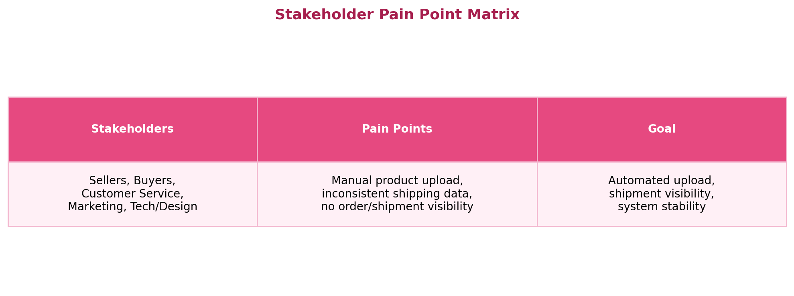
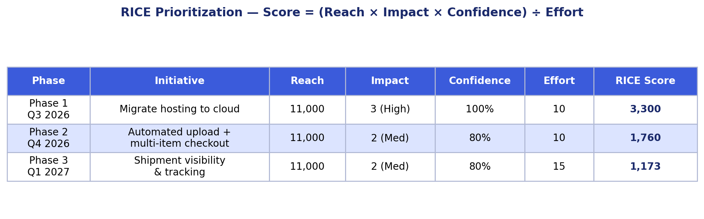
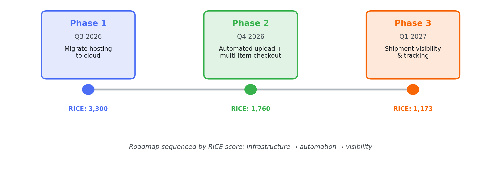

# Case Study 1: PAN-African Seller Marketplace — Platform Strategy & Roadmap

## Overview
A resilient, self-service e-commerce platform designed to empower PAN-African producers with automated tools, giving them a reliable and seamless way to reach global buyers while increasing their profit margins.

## Vision Statement
> To build a resilient self-service e-commerce system that empowers PAN-African producers with automated tools and increases profit margin for both the platform and producers, by providing a reliable, seamless experience for global buyers.

## 1. Discovery: As-Is Journey Map
Mapped the current seller journey to identify friction points before designing the future state:

`Seller Sign Up → Email Product Validation → [manual steps] → Delivers`

Key finding: the process was heavily manual, with no automated validation or visibility once a product was listed — creating delays and inconsistent seller experiences.

## 2. Clarifying Questions Asked
Before scoping a solution, I worked through open questions with stakeholders, including:
- What does "success" look like for sellers vs. buyers on the platform?
- Where does the current process break down or stall?
- What's driving the need for automated hosting?

## 3. Stakeholder Pain Point Matrix
Mapped pain points across every stakeholder group to avoid designing for only one persona:

## 4. Prioritization Framework (RICE-style)
Scored initiatives using Reach, Impact, Confidence, and Effort:

- **Reach** – number of customers affected
- **Impact** – 0.25 (low), 2 (medium), 3 (high)
- **Confidence** – 50% (low), 80% (medium), 100% (high)
- **Effort** – scored in person-weeks (5, 10, 15)
- **Formula** – `Score = (Reach × Impact × Confidence) / Effort`

Migrating hosting to the cloud scored highest (3,300) — it was both the biggest blocker to reliability and the foundation the other two phases depend on, which is why it's sequenced first despite not being the most customer-visible feature.

## 5. Roadmap

| Phase | Timeline | Focus | RICE Score |
|---|---|---|---|
| Phase 1 | Q3 2026 | Migrate hosting to cloud | 3,300 |
| Phase 2 | Q4 2026 | Automated upload, multi-product checkout cart | 1,760 |
| Phase 3 | Q1 2027 | Shipment visibility and tracking | 1,173 |

## 6. Hosting Options Considered
| Option | Description | Trade-off |
|---|---|---|
| Option 1 | Keep existing hosting, penalize system if it goes down | Fast, but doesn't solve root cause |
| Option 2 | Greenfield — modernize entirely | High effort, high long-term payoff |
| Option 3 | Move fully to cloud, automate uploads/visibility/tracking, elastic engine | **Selected** — balances speed and scalability |

**Decision: Option 3** — cloud-hosted, automated, with visibility and tracking built in from the start, rather than patching the existing system or a full from-scratch rebuild.

## 7. User Stories
**User Story 1:** As a platform, I want to be available for global users, hosted in a cloud platform, so that sellers and buyers anywhere can access it reliably.

Supporting stories:
- **Automated Seller Sign-Up** — sellers can onboard without manual review bottlenecks
- **Email Trigger for Approval** — sellers receive automatic notification after successful sign-up validation
- **Automated Product Upload** — sellers upload products without manual processing
- **Multi-Item Cart & Checkout** — buyers add multiple items and check out seamlessly
- **Shipment Tracking** — both sellers and buyers can track shipment status

## Outcome / Projected Impact

| Metric | Before | Target After Phase 3 | Why |
|---|---|---|---|
| Platform uptime | Frequent downtime on legacy hosting | 99.9%+ | Cloud migration removes single point of failure |
| Seller onboarding time | Manual review, multi-day turnaround | Near-instant, automated sign-up + email approval | Automated validation removes manual bottleneck |
| Product listing effort | Manual per-item upload | Bulk/automated upload | Reduces seller drop-off during onboarding |
| Order/shipment visibility | None — buyers and sellers had no tracking | Real-time tracking for both parties | Directly addresses the #1 stakeholder pain point |
| Buyer cart experience | Single-item, friction-heavy checkout | Multi-item cart, seamless checkout | Increases average order value |

**Why this sequencing matters:** rather than building customer-facing features first, the roadmap fixes the reliability foundation (hosting) before layering on automation and visibility — reducing the risk of building new features on unstable infrastructure.

## Key Takeaways
- Used a structured pain-point matrix to avoid solving only the loudest stakeholder's problem
- Applied a quantitative prioritization model (RICE) rather than gut-feel roadmapping
- Chose a phased rollout (infrastructure → automation → visibility) to de-risk delivery instead of a single big-bang launch
