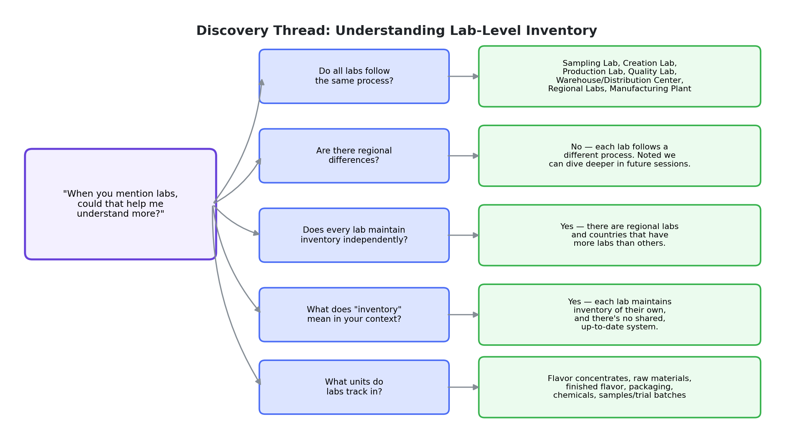
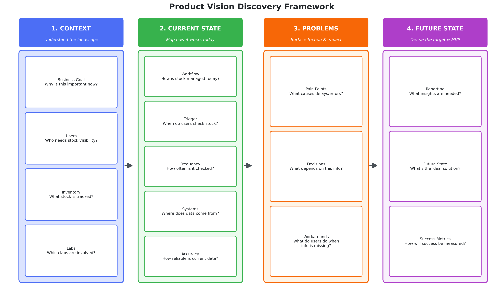

# Case Study 2: Inventory & Stock Visibility — Product Discovery

## Overview
A product discovery exercise focused on a core operational problem: **stock visibility across manufacturing labs.** Rather than jumping to a solution, this case study shows the structured discovery process used to understand the problem space, the stakeholders, and the workflow before scoping any feature.

## The Problem Statement
> "If I understand correctly, today there is no stock visibility in labs. I want to understand more."

This was the opening framing for discovery — deliberately stated as a hypothesis to validate with stakeholders, not an assumption to build from.

## 1. Business Process Flow — Understanding the Landscape
Before designing a solution, I mapped the labs and process types involved to understand where inventory decisions actually happen:

- **Lab types identified:** Sampling Lab, Creation Lab, Production Lab, Quality Lab, Warehouse/Distribution Center, Regional Labs, Manufacturing Plant
- **Key discovery questions:**
  - Do all labs follow the same process?
  - Are there regional differences?
  - Does every lab maintain inventory independently?
  - What does "inventory" mean in each context (raw materials, finished flavor, packaging, chemicals, samples/trial batches)?
  - What units do labs track in (e.g. liters, bottles, or country/region-specific units)?

This mapping revealed that **each lab follows a different process** and **maintains inventory independently**, with **no shared, updated system of record** — a foundational finding that shaped everything downstream.

## 2. Clarifying Questions — Structured by Theme
Rather than asking scattered questions, I organized discovery around a repeatable framework:

**Business Goal**
- Why is this important now?

**Users & Workflow**
- Who needs stock visibility, and who are the primary users of this information?
- Could you walk me through how inventory is managed today?
- What usually triggers someone to check stock? Is it proactive or reactive — manual or automated?
- Is it real-time, updated daily/weekly, or manually updated?
- Are there different processes across lab technicians vs. warehouse staff?

**Systems & Data**
- Which systems are used today (Excel, ERP/SAP, manual log books, phone calls, email)?
- Where does the data come from, and how confident are users in its accuracy?

**Pain Points & Friction**
- Which part of the process is most time-consuming or frustrating?
- Where do delays or mistakes happen most often?
- Can you share an example where limited stock visibility caused a real issue (e.g. low stock, expiring stock, dead stock)?

**Decisions & Workarounds**
- What decisions depend on having accurate stock visibility?
- What existing workarounds do people use when the system doesn't give them what they need?

**Constraints**
- Are there operational or regulatory constraints to keep in mind (batch traceability, expiry dates, hazardous materials, compliance/audit requirements)?

**Future State & Success**
- If we could solve this perfectly, what would the ideal experience look like? ("I want to know instantly whether Lab A or Lab B has enough stock, or I want alerts before we run out.")
- How would we know this feature succeeded six months after launch — fewer stockouts, reduced manual calls, faster planning, less excess inventory, better fulfillment rates?
- **If we could solve only one inventory problem first, which would create the biggest impact?** — This question was used specifically to identify the Minimum Viable Product (MVP).

## 3. Product Vision Discovery Framework
To make this discovery process repeatable across future initiatives, I distilled it into a 4-stage framework that moves from context to a measurable future state:

The framework is designed to be walked left to right in a stakeholder conversation: establish **context** before diagnosing the **current state**, surface **problems** only once the current state is understood (to avoid jumping to solutions), and close on a **future state** with a way to measure success — which is what makes the final "if we could solve only one problem first" question so effective, since by that point the real priorities are already visible.

## Why This Approach
Rather than starting with "what feature should we build," this discovery process deliberately front-loads three things:
1. **Process mapping** — understanding that labs operate independently before assuming a single unified solution would even fit
2. **Structured, themed questioning** — so nothing critical (compliance, regional variance, existing workarounds) gets missed
3. **A single MVP-forcing question** — "if we could solve only one problem first" — to avoid scope creep before a solution is even defined

## Key Takeaways
- Discovery started with a hypothesis stated explicitly ("today there is no stock visibility"), not an assumption baked silently into requirements
- Mapped process variation across labs *before* proposing a solution, avoiding a one-size-fits-all design for a genuinely fragmented process
- Built a reusable discovery framework (15 guiding questions across 15 themes) that can be applied to future product areas, not just this one
- Used a single forcing question to identify the MVP rather than trying to scope everything at once
